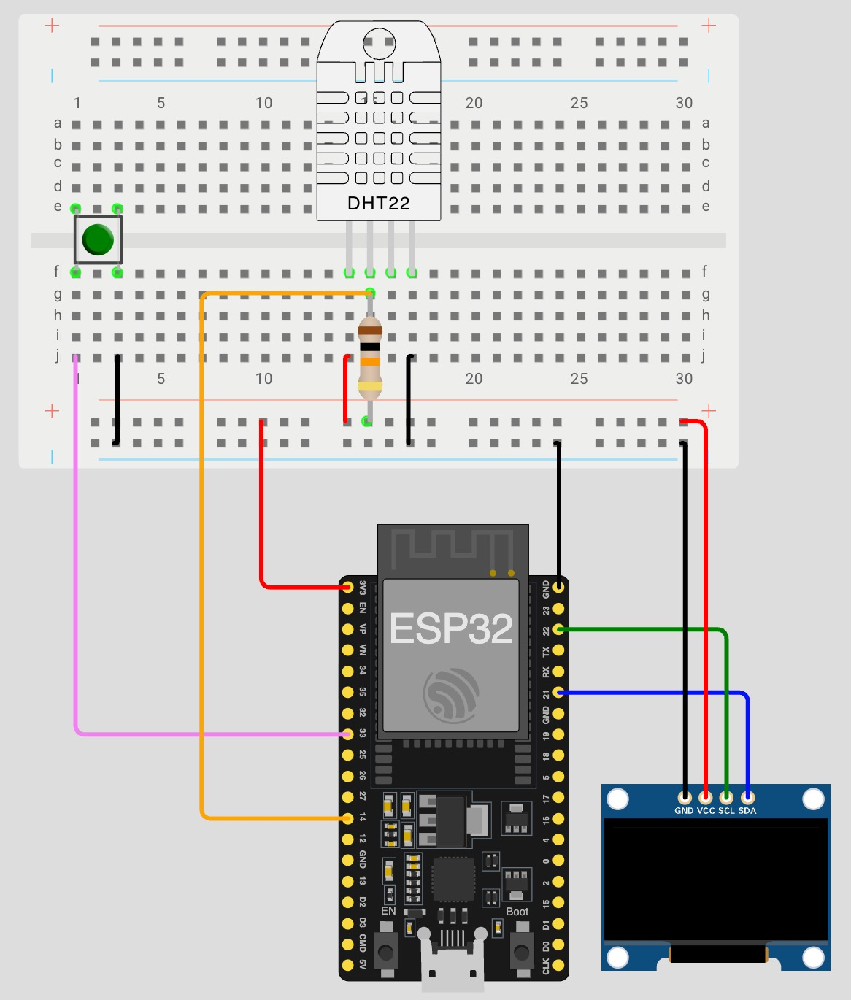

# ESP32 Multithreading Demo

A practical demonstration of FreeRTOS multithreading capabilities on ESP32, featuring concurrent sensor reading, display updates, and interrupt-driven button control.

## 📋 Overview

This project showcases essential multithreading concepts on the ESP32 platform using FreeRTOS. It reads temperature and humidity data from a DHT22 sensor, displays it on an OLED screen, and allows users to pause/resume operations via a button - all running on separate tasks with proper synchronization.

## ✨ Features

This project demonstrates the following FreeRTOS and ESP32 concepts:

- **Dual-Core Task Management**: Tasks pinned to specific cores using `xTaskCreatePinnedToCore()`
- **Queue-Based Communication**: Thread-safe data transfer between sensor reading and display tasks using FreeRTOS queues
- **Task Suspension/Resume**: Dynamic control of task execution states
- **Interrupt Service Routines (ISR)**: Hardware interrupt handling with proper debouncing
- **Atomic Operations**: Thread-safe flag handling using C++ atomic types
- **Task Priority Management**: Different priority levels for sensor reading and display tasks

## 🔧 Hardware Requirements

- **ESP32 Development Board** (WeMos Battery shield or compatible)
- **DHT22 Temperature & Humidity Sensor** (AM2302)
- **SSD1306 OLED Display** (128x64, I2C)
- **Push Button**
- **10kΩ Resistor** (for pull-up, if not using internal pull-up)
- **Breadboard and Jumper Wires**

## 🔌 Wiring Connections

| Component | ESP32 Pin | Notes |
|-----------|-----------|-------|
| DHT22 Data | GPIO 14 | Connect VCC to 3.3V, GND to GND |
| OLED SDA | GPIO 21 | Default I2C SDA |
| OLED SCL | GPIO 22 | Default I2C SCL |
| OLED Address | 0x3C | Default I2C address |
| Button | GPIO 33 | Uses internal pull-up resistor |



## 💻 Software Requirements

- [PlatformIO](https://platformio.org/) (recommended) or Arduino IDE
- ESP32 Board Support Package

### Dependencies

The following libraries are automatically installed via PlatformIO:

- `Adafruit SSD1306` (v2.5.16+)
- `Adafruit DHT sensor library` (v1.4.6+)
- `Adafruit GFX Library` (dependency)

## 🚀 Installation & Setup

### Using PlatformIO (Recommended)

1. Clone this repository:
   ```bash
   git clone <repository-url>
   cd Esp32Multithreading
   ```

2. Open the project in PlatformIO (VS Code):
   ```bash
   code .
   ```

3. Build the project:
   ```bash
   pio run
   ```

4. Upload to your ESP32:
   ```bash
   pio run --target upload
   ```

5. Monitor serial output:
   ```bash
   pio device monitor
   ```

### Using Arduino IDE

1. Install the ESP32 board support via Board Manager
2. Install required libraries via Library Manager:
   - Adafruit SSD1306
   - DHT sensor library
3. Open `src/main.cpp` and upload to your board

## 🎯 How It Works

### Architecture

The project uses three main components running concurrently:

1. **DHT Sensor Task** (Priority 2, Core 1)
   - Reads temperature and humidity every 5 seconds
   - Sends data to a FreeRTOS queue for thread-safe communication
   - Validates readings before queueing

2. **Display Task** (Priority 1, Core 1)
   - Waits for data from the queue
   - Updates OLED display with temperature and humidity
   - Refreshes every 2 seconds

3. **Button Interrupt Handler** (Main Loop)
   - ISR sets an atomic flag when button is pressed
   - Main loop processes the flag outside the ISR context
   - Toggles between active and suspended states for all tasks

### Task Synchronization

Data flows from the sensor task to the display task through a FreeRTOS queue (`QueueHandle_t`), ensuring thread-safe communication without race conditions. The queue has a size of 2 items and uses blocking operations (`portMAX_DELAY`) to handle backpressure.

## 📱 Usage

1. **Power On**: The system starts automatically and begins displaying sensor readings
2. **Press Button**: Suspends both tasks and turns off the display to save power
3. **Press Button Again**: Resumes operation and turns the display back on

The serial monitor (115200 baud) logs system events and sensor readings.

## 📖 Learning Outcomes

This project helps you understand:

- How to create and manage FreeRTOS tasks on ESP32
- Queue-based producer-consumer patterns
- Proper interrupt handling with debouncing
- Task synchronization and communication
- Core affinity and task pinning
- Power management through task suspension

## 🛠️ Configuration

You can modify the following parameters in `main.cpp`:

```cpp
#define DHTPIN 14                         // DHT22 sensor pin
#define BUTTON_PIN 33                     // Button pin
#define SCREEN_ADDR 0x3C                  // OLED I2C address
const long dhtReadingInterval = 5000;     // Sensor read interval (ms)
const unsigned long displayTaskInterval = 2000;  // Display refresh interval (ms)
```

## 📄 License

This project is licensed under the MIT License - see below for details:

```
MIT License

Copyright (c) 2026 Andrea Camillacci

Permission is hereby granted, free of charge, to any person obtaining a copy
of this software and associated documentation files (the "Software"), to deal
in the Software without restriction, including without limitation the rights
to use, copy, modify, merge, publish, distribute, sublicense, and/or sell
copies of the Software, and to permit persons to whom the Software is
furnished to do so, subject to the following conditions:

The above copyright notice and this permission notice shall be included in all
copies or substantial portions of the Software.

THE SOFTWARE IS PROVIDED "AS IS", WITHOUT WARRANTY OF ANY KIND, EXPRESS OR
IMPLIED, INCLUDING BUT NOT LIMITED TO THE WARRANTIES OF MERCHANTABILITY,
FITNESS FOR A PARTICULAR PURPOSE AND NONINFRINGEMENT. IN NO EVENT SHALL THE
AUTHORS OR COPYRIGHT HOLDERS BE LIABLE FOR ANY CLAIM, DAMAGES OR OTHER
LIABILITY, WHETHER IN AN ACTION OF CONTRACT, TORT OR OTHERWISE, ARISING FROM,
OUT OF OR IN CONNECTION WITH THE SOFTWARE OR THE USE OR OTHER DEALINGS IN THE
SOFTWARE.
```

## 👤 Author

**Andrea Camillacci**

---

*This is a learning project designed to demonstrate FreeRTOS multithreading concepts on ESP32. Feel free to use it as a reference for your own projects!*
